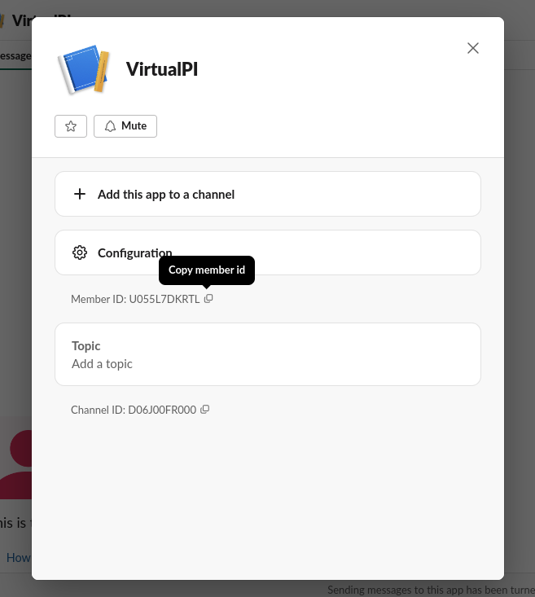
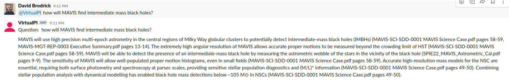

# LM in Slack 
A lightweight code to connects LM to chatbot.

## Configuration
#### API keys
```bash
# create your .env file:
cp .env-example .env 
# set your environment variables:
vim .env
```
#### Launching the bot
To run the script, you require:
  * A working Python3 environment with the following packages available:
    * `pip3 install -r requirements.txt`
  * An OpenAI [API key](https://help.openai.com/en/articles/4936850-where-do-i-find-my-secret-api-key).
  * You can [Create a new Slack app](https://api.slack.com/tutorials/tracks/responding-to-app-mentions) that is preconfigured with the necessary permissions by pressing the green 'Create App' button on that link.
    * You can change the name of your app/bot (you'll use this to interact with it on Slack, by editing the 'manifest' file when the option is presented.
    * You will need to copy the App and Bot Tokens to set as environment variables, as described below.
    * This might be a useful tutorial: https://www.youtube.com/watch?v=qKZLDEIL2r0 

The three API tokens you have generated should be exported to your shell environment at runtime:

```bash
export OPENAI_API_KEY="sk-M...M"
export SLACK_APP_TOKEN="xapp-1...d"
export SLACK_BOT_TOKEN="xoxb-2...C"
```
e.g., by `source`ing the `.env` file after modifying it.

Then you can start the app as follows.

```bash
python3 main.py
```

#### Recording Reactions
In some cases, you may wish to gather the reactions to bot messages (e.g., for further optimisation of the bot) by scanning a channel.
Assuming the `.env` is setup correctly, you can save this data to disk `bot_messages.json` using by running the `scan_messages.py` script:
```bash
python scan_messages.py
```

To get the bot's user id (required in `.env`), find the bot's profile on your slack channel, and copy the id shown (starting with `U...`), e.g.:




### Using [just](https://github.com/casey/just):
`just` allows the abstraction of a few of these setup tasks, see the full set of tasks in the `.justfile`.

After setting API keys (as above), you can create a virtual environment, install dependencies, and create a `./pdfs/` directory, by running:
```bash
just setup
```

Then (after adding your PDFs to `./pdfs/` you can start the slackbot using:
```bash
just run
```

To record the reactions by scanning a slack channel, set the appropriate `.env` variables and run:
```bash
just scan
```

## Saving State

When the script starts it will check if a pickled version of the dense vector containing the documents is already available in the PDF directory. If found it will use that existing state (which saves time and the cost of API calls), otherwise it will parse the PDFs, embed them into the FAISS dense vector and then save this state for next time.

NB: If you add/remove PDFs you will need to remove the state file!

```bash
rm /path/to/your/PDF/directory/docs.pkl
```
or
```bash
just clean
```

## Add to Slack Workspace

By now your app should be happily running. The final step is to actually add it to your Slack workspace.

  * In Slack, Click the '... More' on the top left.
  * Select 'Apps'.
  * Select the new app you created above.
  * Then go to a Slack channel and tag the app with a question e.g. `@WhateverYouCalledYourApp what is the meaning of this?`

**NB: The app will only respond to mentions in a Slack channel, not to DMs.**

An example interaction is shown below:


#### Docker
Running with Docker is probably the easiest all round solution, but can make debugging a bit more tedious. To run with docker, use:
```bash
docker build -t virtualpi:latest
docker run --restart=unless-stopped -d -v ./pdfs:/app/pdfs --env-file=./.env virtualpi
```
This has the benefit of allowing multiple bots running on varied pdf sources. You can build the image once, then spin up a new container (changing the `./pdfs` directory and probably `.env`.

Note that for now, the `.env` format is not compatible between `just run` and `docker run`. For Docker, remove the `export` and quotation marks from the `.env` file. TODO: fix this.
